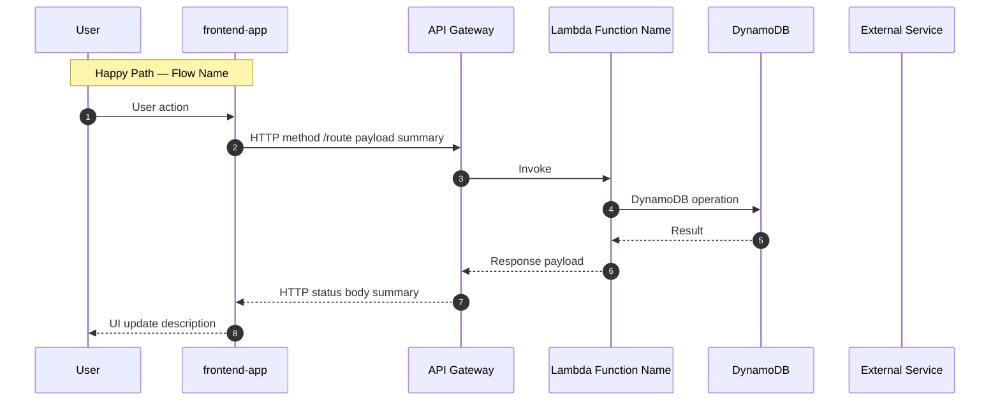

<!-- MODEL_TIER: sonnet -->
---
description: >
  Create and maintain canonical system sequence diagrams based on domain model
  outputs and/or existing application code. Generates mermaid diagrams for happy
  paths and failure modes. Maintains a discoverable diagrams-index.json.
arguments:
  - name: prompt
    description: What flows to diagram. Reads from session state if available.
    required: true
  - name: --session
    description: Existing session ID to continue from (optional)
    required: false
agent-invokeable: true
---

> **Skill references:**
> - [design/interview](.claude/skills/design/interview.skill.md)
> - [design/dual-review](.claude/skills/design/dual-review.skill.md)
> - [design/design-confidence](.claude/skills/design/design-confidence.skill.md)
> - [design/session-state](.claude/skills/design/session-state.skill.md)
> - [design/output-format](.claude/skills/design/output-format.skill.md)

**Announce:** "Running /design:diagram — generating canonical sequence diagrams."

---

## Phase 0: Session + Interview

Load existing session (if `--session` provided or domain-model phase exists in latest session).

If no prior session state: run full interview (`design/interview.skill.md`).
If domain-model phase output exists: skip interview, use that phase's outputs as inputs.

---

## Phase 1: Load Diagrams Index

```bash
DIAGRAMS_INDEX="${DESIGN_DIAGRAMS_PATH}/diagrams-index.json"

if [ -f "$DIAGRAMS_INDEX" ]; then
  cat "$DIAGRAMS_INDEX"
else
  echo '{"diagrams": [], "last_updated": ""}' > "$DIAGRAMS_INDEX"
  echo "Created empty diagrams-index.json"
fi
```

The index tracks every canonical diagram:

```json
{
  "diagrams": [
    {
      "id": "session-launch-happy-path",
      "title": "Session Launch — Happy Path",
      "bounded_contexts": ["ApplicationContext", "TokenLedgerContext"],
      "flow_type": "happy-path | failure | edge-case",
      "file_path": "designs/diagrams/session-launch-happy-path.mmd",
      "session_path": "designs/sessions/20260313-session-launch/diagrams/session-launch-happy-path.mmd",
      "last_updated": "2026-03-13T10:00:00Z",
      "status": "current | stale | deprecated"
    }
  ],
  "last_updated": "2026-03-13T10:00:00Z"
}
```

Check for existing diagrams that overlap with the current prompt's flows.
If overlap found: update existing diagrams rather than creating duplicates.

---

## Phase 2: Identify Flows to Diagram

From session state interview output (or re-derived from prompt):
1. **Happy path** — primary success scenario (always required)
2. **Each failure mode** — from interview Q4 (all required)
3. **Cross-context flows** — any flow that crosses bounded context boundaries
4. **Edge cases** — from architect review of interview outputs

Produce a flow inventory:
```
| Flow ID | Title | Type | Bounded Contexts | Existing Diagram? |
|---|---|---|---|---|
| session-launch-happy | Session Launch | happy-path | Application, TokenLedger | No |
| session-launch-quota-exceeded | Session Launch — Quota Exceeded | failure | Application, TokenLedger | No |
```

---

## Phase 3: Generate Mermaid Diagrams (sonnet)

For each flow in the inventory:

### Mermaid Conventions

Always follow this structure:



**Rules:**
- Use `autonumber` always
- Label participants with short names (SPA, API, FN, DB)
- Show HTTP methods and routes explicitly
- Show DynamoDB operations explicitly (GetItem, PutItem, UpdateItem, Query, TransactWrite)
- For failure diagrams: show `alt` blocks with `else` for error path
- For cross-context flows: add Note blocks at context boundary transitions
- Token/payment flows MUST show `par` blocks for concurrent operations

### CRITICAL: Mermaid 10.x Syntax Restrictions

The following constructs **break the Mermaid parser** and must NEVER appear in generated diagrams:

| Forbidden | Use instead |
|-----------|-------------|
| `{key: value}` in arrow text | `key=value` flat format |
| `{field1, field2}` in arrow text | `field1 field2` space-separated |
| `"quoted string"` in arrow text | unquoted plain text |
| `>=`, `<=`, `<`, `>` in arrow text or Notes | `at or above`, `at or below`, `less than`, `greater than` |
| `{env}`, `{id}` in URL paths in arrow text | `env`, `id` — remove curly braces |
| Unicode chars (`✓`, `→`, `≤`, `≥`) | plain ASCII equivalents |
| `Authorization: Bearer {jwt}` | `Authorization: Bearer jwt` |

**Note block content** (`Note over X: ...`) follows the same rules. Use `<br/>` for multi-line notes.

**Safe examples:**
```
# WRONG
SPA->>API: POST /sessions/{sessionId}/purchases {itemId, price: 10}
Note over FN: balance >= 100

# CORRECT
SPA->>API: POST /sessions/sessionId/purchases itemId price=10
Note over FN: balance at or above 100
```

**Participant aliases** may contain parentheses for clarification: `participant API as API Gateway (dev)` — this is safe.

### Load actual Lambda names from codebase

```bash
# Read actual function names to use in diagrams
ls "${PROJECT_ROOT}/lambda-functions/" 2>/dev/null | head -20
```

---

## Phase 4: Dual Review

**Load skill:** `design/dual-review.skill.md`

**Diagram-specific adversarial checks:**
- Does every participant in the diagram actually exist in the codebase?
- Are there flows shown that can't actually happen?
- Is the diagram showing implementation details that should be abstracted?
- Are there duplicate diagrams that could be consolidated?

**Diagram-specific architect checks:**
- Do cross-context transitions show the right integration pattern (sync/async)?
- Are all error paths shown, not just the happy path?
- Do DynamoDB operations match the actual table structure?
- Are parallel operations (transactions) modeled correctly with `par` blocks?

Integrate all feedback.

---

## Phase 5: Confidence Check

**Load skill:** `design/design-confidence.skill.md`

For `diagram` phase, Check 3 (Output Completeness) requires:
- Happy path diagram exists
- All failure modes from interview have diagrams
- `diagrams-index.json` is updated

---

## Phase 6: Write Outputs

### Write individual diagram files

For each diagram:
```bash
# Session-scoped copy
cat > "${DESIGN_DOCS_PATH}/sessions/${SESSION_ID}/diagrams/${FLOW_ID}.mmd" << 'EOF'
{mermaid content}
EOF

# Canonical copy (the authoritative one)
cat > "${DESIGN_DIAGRAMS_PATH}/diagrams/${FLOW_ID}.mmd" << 'EOF'
{mermaid content}
EOF
```

### Update diagrams-index.json

Add or update entries for all diagrams generated in this session.

```bash
# Python script to update the index
python3 -c "
import json, datetime
idx = json.load(open('${DESIGN_DIAGRAMS_PATH}/diagrams-index.json'))
# ... add/update entries ...
idx['last_updated'] = datetime.datetime.utcnow().isoformat() + 'Z'
json.dump(idx, open('${DESIGN_DIAGRAMS_PATH}/diagrams-index.json', 'w'), indent=2)
"
```

### Write human-readable summary

**File:** `${DESIGN_DOCS_PATH}/sessions/{session_id}/diagram.md`

### Update session state

**File:** `${DESIGN_DOCS_PATH}/sessions/{session_id}/state.json`

### Commit

```bash
cd "${PROJECT_ROOT}"
git add "${DESIGN_DOCS_PATH}/sessions/${SESSION_ID}/" "${DESIGN_DIAGRAMS_PATH}/"
git commit -m "design(${SESSION_ID}): complete diagram phase — {N} diagrams"
```

---

## Phase 7: Show Results

Display to user:
1. Diagram inventory (table of all diagrams created)
2. Each diagram rendered inline (mermaid code blocks)
3. Confidence score
4. Note any existing diagrams that were updated (vs. created new)
